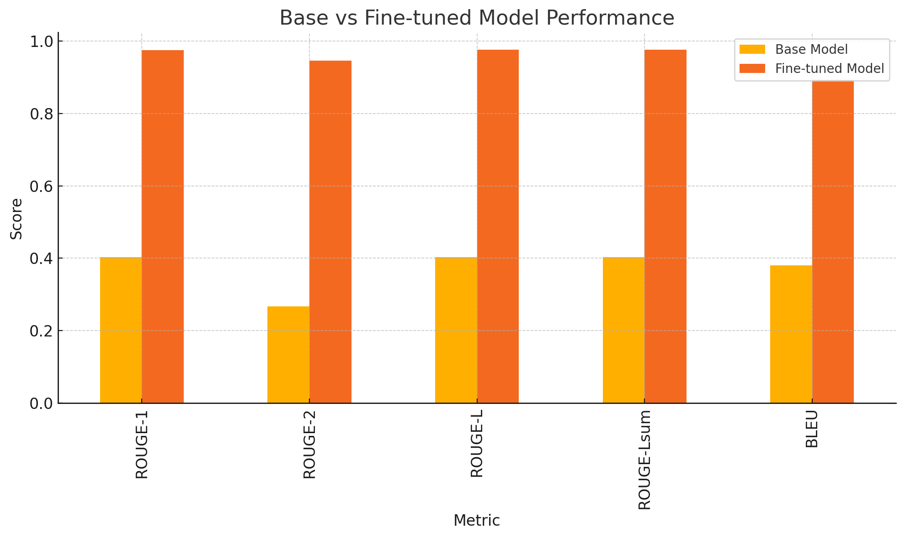
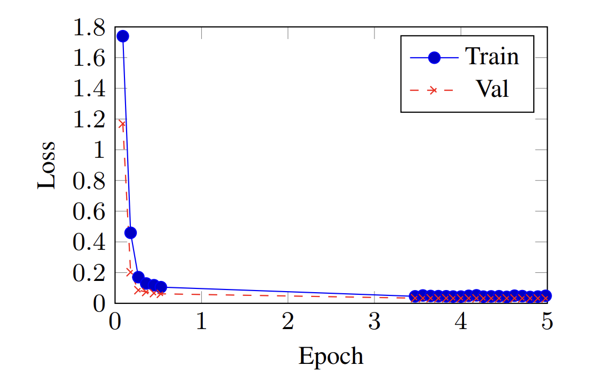
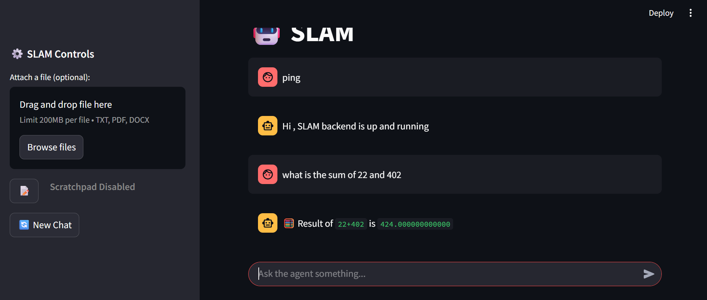

# SLAM • Small Language Agentic Machine

 **Agent-like reasoning**  **Modular tools** **Fully offline**  
 A two-stage, local-first assistant that rewrites, reasons … and runs your tools without the cloud.

---

##  Abstract
SLAM couples an **adapter-tuned T5 rewriter** with a **small decoder-only generator** (Phi-4-mini).  
A lean in-process controller validates JSON tool calls, executes a sandboxed registry (calculator, OCR, summariser, …), and inserts each result back into the generation flow. Everything runs locally; no external APIs are required.

---

##  Project Structure
```text
.
├── src/                  # core backend, SLM, tool registry, UI
│   ├── BACKEND/          # FastAPI server + controller logic
│   ├── MODELS/           # gguf + LoRA adapters
│   └── UI/               # Streamlit chat front-end
├── notebooks/            # data-generation + analysis
├── data/                 # synthetic & real training data
├── deploy/               # Docker / Compose / k8s manifests
└── README.md
```


# 1 – Python venv
```
python3 -m venv slam-env && source slam-env/bin/activate
pip install -r requirements.txt
```

# 2 – Run backend
```
cd src/BACKEND
uvicorn main:app --reload                 # → http://localhost:8000/docs
```

# 3 – Run Streamlit UI (new terminal)
```
cd ../../UI
streamlit run main.py                     # → http://localhost:8501
```


##  Features

- Category What it gives you
- Two-stage pipeline T5 ⇒ concise instruction → SLM reasoner
- Modular tools Calculator · Python shell · OCR · Summariser …
- Schema-first safety Strict JSON validation ⇢ no silent injection
- Adapter fine-tuning LoRA on T5 Base (≈ 11 M trainable params)
- Privacy-first No data leaves your machine


##  Data Generation
- 10 k seed tasks → 5 paraphrases each via GPT-3.5
- Automatic rewrite into imperative form
- Manual profanity / schema filter


##  Prompt-Engineering Heuristics
- Use <|user|> / <|assistant|> BPE split tokens to stop generation.
- Force low-temperature (0.2) inside “tool” blocks; higher (0.7) elsewhere.


##  Evaluation

### 1 – Base vs Fine-tuned (rewriter)



| Metric      | Base | Fine-tuned |
|-------------|-------|------------|
| ROUGE-1     | 0.40  | 0.98       |
| ROUGE-2     | 0.27  | 0.95       |
| ROUGE-L     | 0.40  | 0.98       |
| ROUGE-L_sum | 0.40  | 0.98       |
| BLEU        | 0.38  | 0.89       |

### 2 – Prompt-Rewriting Summary

| Metric      | Score | Interpretation                                   |
|-------------|-------|--------------------------------------------------|
| BLEU       | 0.48  | 🟡 Moderate token overlap – expected re-phrasing |
| BERTScore   | 0.99  | 🟢 Near-perfect semantic fidelity                 |
| METEOR      | 0.76  | 🟢 Good synonym/ordering match                    |
| ROUGE-L     | 0.99  | 🟢 Excellent structural alignment                  |


### 3 Training Loss against Epochs


Insights
 • High BERTScore + ROUGE-L ⇒ intent & structure preserved — ideal for tool routing.
 • Moderate BLEU shows healthy paraphrasing, not verbatim copying.


## Screenshots
### SLAM UI

### Tool Registry on fastapi

### FastAPI logs when running SLAM for tool calling


## Contributors

Aravind SS · Manoj Kokane · Parth Bhatia · Sachin Bansal · Srividhya L · Swapnil Trivedi
